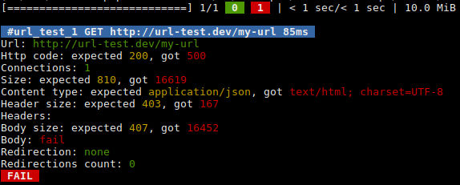

[](https://github.com/steevanb/php-url-test/tree/0.0.4)


php-url-test
============

Tests all urls of your application

[Changelog](changelog.md)

Installation
============

/!\ Keep in mind this is an alpha version /!\

```bash
composer require "steevanb/php-url-test": "^0.0"
```

Launch tests
============

```bash
# scan src/ to find *.urltest.yml files, --recursive=true or -r=true to do it recursively
./bin/urltest.php src/

# test url_test_foo
./bin/urltest.php src/ url_test_foo

# test url_test_foo and all tests who match preg pattern /^url_test_bar[0..9]{1,}$/
./bin/urltest.php src/ url_test_foo,/^url_test_bar[0..9]{1,}$/

# launch tests in foo.urltest.yml only
./bin/urltest.php src/Tests/foo.urltest.yml

# use ConsoleResponseComparator to show test comparison, use -v, -vv or -vvv to get more informations
# use ConsoleResponseComparator to show only fail test comparison (by default), use -v, -vv or -vvv to get more informations
./bin/urltest.php --comparator=console --errorcomparator=console src/
```



Dump configuration
==================

```bash
# dump only global configuration
./bin/urltest.php --dump-configuration src/

# dump global configuration, and url_test_foo configuration
./bin/urltest.php --dump-configuration src/ url_test_foo

# dump global configuration, url_test_foo configuration and all configurations who id match preg pattern /^url_test_bar[0..9]{1,}$/
./bin/urltest.php --dump-configuration src/ url_test_foo,/^url_test_bar[0..9]{1,}$/
```

YAML test file example
======================

Only _request.url_ is required.

```yaml
testId:
    request:
        url: http://test.dev
        timeout: 30
        port: 80
        method: GET
        userAgent: Mozilla/5.0 (X11; Linux x86_64) AppleWebKit/537.36 (KHTML, like Gecko) Chrome/56.0.2924.87 Safari/537.36
        referer: http://referer.com
        allowRedirect: true
        # list of headers to add to request
        headers:
            X-Foo: bar
    expectedResponse:
        url: http://test.dev
        code: 200
        size: 300
        contentType: text/html
        numConnects: 1
        # set count if you know exaclty number of redirects you want to test, or min/max
        redirect:
            min: 1
            max: 1
            count: 1
        header:
            size: 200
            # list of headers who has to exists, and have exaclty this value
            headers:
                X-Foo: bar
            # list of headers should not exists
            unallowedHeaders:
                - X-Bar
        body:
            # content to compare with response, <file($fileName)> will get content of $fileName
            content: <file('content.html')>
            size: 100
            # transformer id : transform data from content key before comparing it to response
            transformer: json
            # file name where tranformed expected content will be saved, if you need to test your transformer for example
            fileName: /tmp/urlTestResult/expectedResponse.html
    response:
        body:
            # transformer id : transform data from response body before comparing it to expected response
            transformer: json
            # file name where response body will be saved
            fileName: /tmp/urlTestResult/response.html
```

You can define default configurations for all tests in your _.urltest.yml_ file :
```yaml
_default:
    # here you can define sames configurations as for a test
    # this configurations will be applied to all tests in this file, if value is not defined, null or ~
```
